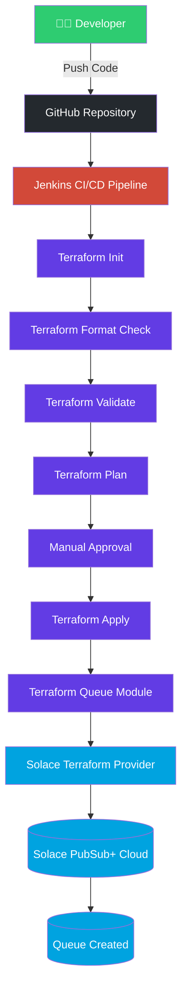

# Terraform Solace Queue Automation


An enterprise-ready Infrastructure as Code (IaC) project that automates Solace PubSub+ queue provisioning using Terraform and Jenkins. The project demonstrates CI/CD best practices, reusable Terraform modules, environment-specific deployments, and secure credential management.

---

## 🏗️ Architecture



---

## Features

- Infrastructure as Code using Terraform
- Automated Solace PubSub+ Queue Creation
- Jenkins CI/CD Pipeline
- Reusable Terraform Modules
- Multi-Queue Deployment using `for_each`
- Environment-specific Configuration
- Secure Jenkins Credentials
- Terraform Format Validation
- Terraform Configuration Validation
- Manual Approval before Deployment
- Archived Terraform Execution Plan
- Timestamped Jenkins Builds
- Build Retention Policy
- Concurrent Build Protection

---

## Project Structure

```text
terraform-solace-queue-automation/
│
├── Jenkinsfile
│
├── terraform/
│   ├── environments/
│   │   ├── dev.tfvars
│   │   ├── pqa.tfvars
│   │   ├── qa.tfvars
│   │   └── prod.tfvars
│   │
│   ├── modules/
│   │   └── queue/
│   │       ├── main.tf
│   │       ├── variables.tf
│   │       └── outputs.tf
│   │
│   ├── providers.tf
│   ├── variables.tf
│   ├── locals.tf
│   ├── queue.tf
│   ├── outputs.tf
│   └── versions.tf
│
└── README.md
```

---

## Technologies Used

| Technology | Purpose |
|------------|---------|
| Terraform | Infrastructure as Code |
| Jenkins | CI/CD Pipeline |
| Solace PubSub+ | Messaging Platform |
| GitHub | Source Code Management |

---

## Pipeline Flow

```text
Checkout
    │
Terraform Init
    │
Terraform Format Check
    │
Terraform Validate
    │
Terraform Plan
    │
Archive tfplan
    │
Manual Approval
    │
Terraform Apply
    │
Solace Queue Created
```

---

## Prerequisites

- Terraform
- Jenkins
- Git
- Solace PubSub+ Cloud
- Jenkins Credentials
- GitHub Repository

---

## Setup

### Clone Repository

```bash
git clone https://github.com/your-repository.git
```

### Initialize Terraform

```bash
terraform init
```

### Validate

```bash
terraform validate
```

### Plan

```bash
terraform plan
```

### Apply

```bash
terraform apply
```

---

## Jenkins Pipeline

Describe how the pipeline works.

(Add screenshots later.)

---

## Screenshots

- Jenkins Dashboard
- Pipeline Execution
- Solace Queue
- GitHub Repository

(Add later.)

---

## Future Enhancements

- Remote Terraform State
- Queue Subscriptions
- Topic Endpoints
- ACL Profiles
- Client Usernames
- Multiple Environment Pipelines
- Pull Request Validation
- Email Notifications
- Teams Notifications

---

## Author

**Rohit Prasad**

SAP BTP Integration Suite Developer | Terraform | Jenkins | Solace PubSub+
